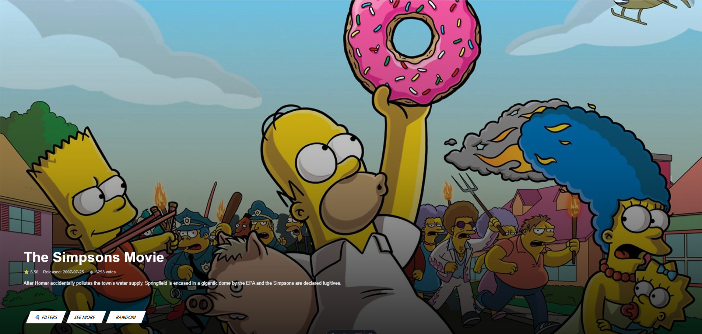

# 🎬 Astro TMDB Movie Showcase

A dynamic movie showcase built with **Astro** and **Tailwind CSS**, powered by the [TMDb API](https://www.themoviedb.org/documentation/api).



---

## 🚀 Features

- 🎥 Random featured movie with background and details
- 🎞️ Horizontally scrolling "Popular Movies" marquee
- 🔎 Filter UI by streaming service (Netflix, Disney+, etc.)
- 🧭 Manual scroll and styled scrollbar
- 🪄 Hover to pause animations
- 📱 Responsive & fast UI with Astro's island architecture

---

## 🔧 Tech Stack

- **Framework:** [Astro](https://astro.build/)
- **Styling:** [Tailwind CSS](https://tailwindcss.com/)
- **Animation:** CSS `@keyframes` + Tailwind utilities
- **API:** [TMDb Movie API](https://developers.themoviedb.org/3)

---

## 🖼️ Live Demo

> [https://myfilmfortune.netlify.app/](https://myfilmfortune.netlify.app/)

---

## 🧠 How It Works

- On page load, a random page from the TMDb popular movies is fetched.
- A movie is featured in the hero section with backdrop, title, rating, and overview.
- A horizontally scrolling marquee of posters displays the rest of the popular movies.
- Clicking “See more” opens the movie's TMDb page.
- Marquee animation pauses on hover for easier interaction.

---

## 🛠️ Getting Started

```bash
# Clone the repo
git clone https://github.com/yourusername/astro-tmdb-showcase
cd astro-tmdb-showcase

# Install dependencies
npm install

# Start the dev server
npm run dev

```

## 📁 Project Structure

```
src/
├── components/
│   └── scripts
│      └── RandomMovieBtn.astro
│   └── MovieCard.astro
│   └── Footer.astro
│   └── MovieList.astro
├── functions/
│   └── fetchJsonMWDP.ts
├── layouts/
│   └── Layout.astro
├── pages/
│   └── index.astro
├── styles/
│   └── global.css

```

---

## 🌐 Environment Variables

Create a `.env` file with your TMDb API key:

```
TMDB_API_KEY=your_tmdb_api_key
```

---

## 🧼 Custom CSS (Scrollbars)

```css
::-webkit-scrollbar {
  height: 8px;
}
::-webkit-scrollbar-thumb {
  background: rgba(255, 255, 255, 0.3);
  border-radius: 6px;
}
```

---

## 📸 Screenshots

_You can add more screenshots here as your project grows._

---

## 📄 License

This project is licensed under [MIT](./LICENSE).

---

## ✨ Author

**mainm0e (Adithep Tamwisai)**  
🔗 [Portfolio](https://mainm0e.netlify.app/fi/)  
👨‍💻 [Linkedin](https://www.linkedin.com/in/adithep-tamwisai-3b0a7525b/)  
